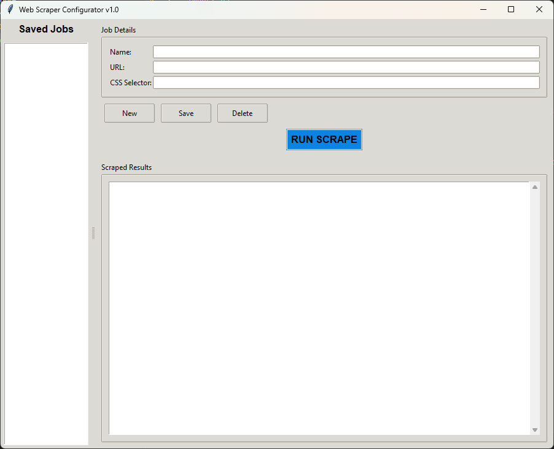

# Web Scraper Configurator



A powerful desktop application that enables users to visually configure, save, and execute web scraping jobs without writing any code. All scraping configurations are persistently saved to a local `configs.json` file.

## Features

- **Visual Job Management**: Create, save, and organize scraping jobs through an intuitive GUI
- **CSS Selector Support**: Precisely target page elements using CSS selectors
- **Persistence**: All configurations automatically saved to JSON format
- **Real-time Results**: Immediate display of scraping results in the application
- **Error Handling**: Clear error messages for network issues and scraping problems
- **Multi-job Support**: Manage multiple scraping configurations simultaneously

## Installation

1. **Prerequisites**:
   - Python 3.6+
   - Required packages: `requests`, `beautifulsoup4`

2. **Install dependencies**:
   ```bash
   pip install requests beautifulsoup4
   ```

3. **Run the application**:
   ```bash
   python scraper_platform.py
   ```

## Usage

1. **Create a new job**:
   - Enter job name, target URL, and CSS selector
   - Click "Save" to store the configuration

2. **Manage jobs**:
   - Select a job from the list to edit or delete
   - Use "New" to clear the form and create another job

3. **Execute scraping**:
   - With a job selected, click "RUN SCRAPE" to execute
   - Results appear in the bottom panel

## Technical Details

- **Backend**: Python 3 with Requests and BeautifulSoup
- **Frontend**: Tkinter GUI framework
- **Data Storage**: JSON configuration file (`configs.json`)
- **Error Handling**: Comprehensive network and parsing error detection
